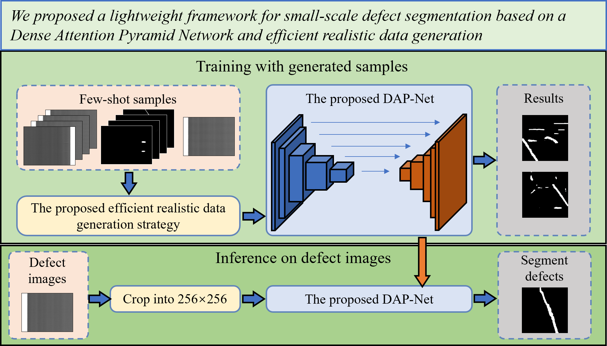
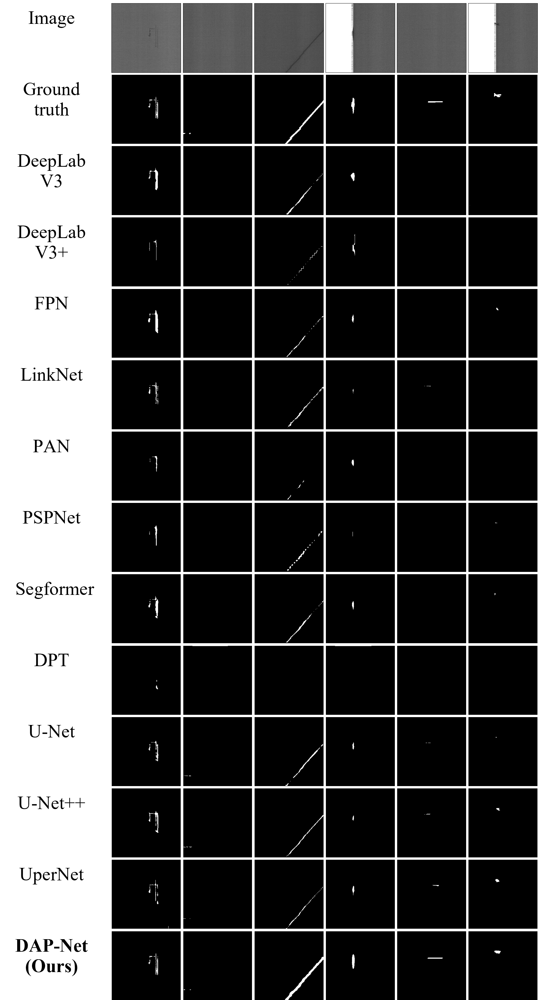

# Dense Attention Pyramid Network (DAP-Net) for Fiberglass Defect Segmentation

<p align="center">
  <a href="https://doi.org/10.5281/zenodo.17491225">
    
  </a>
</p>

This repository contains the associated scripts, components, and evaluation tools for the paper:

> **Enhancing Small-Scale Fiberglass Defect Segmentation: A Dense Attention Pyramid Network with Realistic Data Augmentation**  
> *Submitted to The Visual Computer, 2025.*
   <p align="center"></p>

---

## 🔍 About This Repository

This repository provides partial implementations and experimental materials supporting the above submission.  
Due to confidentiality agreements with our industrial partner — a third-party quality inspection company — the **full dataset** and **complete network implementation** cannot be disclosed at this stage.
To promote transparency and reproducibility, we release the following components:

- ⚙️ Training and inference pipelines  
- ⚡ FPS and computational efficiency evaluation scripts  
- 📊 Performance metric computation tools (I-F1, P-AP, P-F1, etc.)  
- 📉 Model parameter and FLOPs calculation utilities  
- 🧮 Some other components of the proposed network

Illustrations and qualitative results shown in the paper are provided in the [`assets/`](./assets) folder.

---

## 🧠 Overview of the Proposed Framework

Fiberglass, a critical material in industrial applications, often exhibits small and inconspicuous defects that are difficult to detect with traditional vision-based methods, particularly under few-shot conditions.

To address this challenge, we propose **DAP-Net (Dense Attention Pyramid Network)** — a defect segmentation framework combining a dense feature encoder, pyramid decoder, and CBAM attention mechanism with a **efficient realistic data generation strategy**.

### 🔸 Key Contributions

1. **Dense Attention Pyramid Network (DAP-Net)**  
   Integrates a **dense encoder**, **pyramid decoder**, and **CBAM attention** to enhance multi-scale feature interaction and improve subtle defect localization. 
   - DAP-Net overall architecture
   
   - Dense encoder 
   
   - Feature pyramid decoder

2. **Realistic Data Synthesis Strategy**  
   Adaptively fuses limited real samples to synthesize diverse defect patterns, effectively addressing few-shot learning challenges.  

3. **Lightweight and High-Performance Segmentation**  
   Achieves **I-F1 94.84%**, **P-AP 73.24%**, and **P-F1 70.93%**, demonstrating state-of-the-art results with compact model size and real-time efficiency.  

    ### Table: Comparison of the performance of various semantic segmentation methods  
    The best results are shown in **bold**, and the second-best results are <u>underlined</u>.

    | Method | I-AUROC (%) | I-AP (%) | I-F1 (%) | P-AUROC (%) | P-AP (%) | P-F1 (%) | P-AUPRO (%) |
    |:--------|:------------:|:---------:|:----------:|:------------:|:----------:|:-----------:|:-------------:|
    | U-Net [[1]](#1) | 97.31 | 96.10 | 91.09 | 93.05 | 69.48 | 70.10 | 85.69 |
    | U-Net++ [[2]](#2) | **98.30** | **97.37** | <u>93.91</u> | <u>94.86</u> | <u>70.70</u> | <u>70.52</u> | 88.44 |
    | FPN [[3]](#3) | <u>98.22</u> | 97.02 | 91.72 | 93.84 | 65.40 | 68.06 | 90.19 |
    | PSPNet [[4]](#4) | 95.94 | 92.32 | 85.59 | 94.30 | 66.35 | 66.57 | 91.14 |
    | DeepLabV3 [[5]](#5) | 89.43 | 86.06 | 76.59 | **94.87** | 67.14 | 68.28 | 86.39 |
    | DeepLabV3+ [[6]](#6) | 97.69 | 96.35 | 90.37 | 94.75 | 65.12 | 67.32 | **91.79** |
    | LinkNet [[7]](#7) | 75.38 | 71.43 | 63.40 | 94.13 | 59.15 | 63.20 | 86.34 |
    | PAN [[8]](#8) | 94.37 | 92.89 | 86.15 | 93.05 | 66.63 | 67.43 | 88.47 |
    | UPerNet [[9]](#9) | 97.91 | 96.05 | 91.34 | 91.39 | 64.79 | 68.04 | 84.56 |
    | Segformer [[10]](#10) | 96.07 | 94.79 | 88.45 | 93.28 | 64.95 | 67.45 | 87.31 |
    | DPT [[11]](#11) | 86.08 | 58.34 | 76.26 | 92.50 | 47.31 | 58.61 | 86.90 |
    | ID-Unet [[12]](#12) | 98.19 | 96.70 | 92.19 | 90.15 | 67.92 | 67.72 | 83.69 |
    | **DAP-Net (Ours)** | <u>98.22</u> | <u>97.23</u> | **94.84** | 94.57 | **73.24** | **70.93** | <u>91.22</u> |

    ---

    #### References
    <a id="1">[1]</a> Ronneberger et al., *U-Net: Convolutional Networks for Biomedical Image Segmentation*, 2015.  
    <a id="2">[2]</a> Zhou et al., *UNet++: A Nested U-Net Architecture for Medical Image Segmentation*, 2018.  
    <a id="3">[3]</a> Lin et al., *Feature Pyramid Networks for Object Detection*, 2017.  
    <a id="4">[4]</a> Zhao et al., *Pyramid Scene Parsing Network*, 2017.  
    <a id="5">[5]</a> Chen et al., *Rethinking Atrous Convolution for Semantic Image Segmentation*, 2017.  
    <a id="6">[6]</a> Chen et al., *Encoder-Decoder with Atrous Separable Convolution for Semantic Image Segmentation*, 2018.  
    <a id="7">[7]</a> Chaurasia et al., *LinkNet: Exploiting Encoder Representations for Efficient Semantic Segmentation*, 2017.  
    <a id="8">[8]</a> Li et al., *Pyramid Attention Network for Semantic Segmentation*, 2018.  
    <a id="9">[9]</a> Xiao et al., *Unified Perceptual Parsing for Scene Understanding (UPerNet)*, 2018.  
    <a id="10">[10]</a> Xie et al., *SegFormer: Simple and Efficient Design for Semantic Segmentation with Transformers*, 2021.  
    <a id="11">[11]</a> Chen et al., *DPT: Vision Transformers for Dense Prediction Tasks*, 2021.  
    <a id="12">[12]</a> Chen et al., *ID-UNet: A densely connected UNet architecture for infrared small target segmentation.*, 2025.

   - Qualitative results
   <p align="center"></p>

---

## ⚙️ Environment Configuration

### System
- **OS**: WSL2 (Ubuntu 22.04)
- **Python**: 3.11.0
- **CUDA**: 12.1

### Core Frameworks
| Library | Version |
|----------|----------|
| torch | 2.5.1+cu121 |
| torchvision | 0.20.1+cu121 |
| segmentation-models-pytorch | 0.5.1.dev0 |
| timm | 1.0.16 |
| thop | 0.1.1.post2209072238 |

### Installation Guide

1. **Clone the repository**
    ```bash
    git clone https://github.com/<your_username>/DAP-Net.git
    cd DAP-Net
2. **(Recommended) Create a virtual environment**
    ```bash
    python3 -m venv venv
    source venv/bin/activate
3. **Install dependencies**
    ```bash
    pip install -r requirements.txt
4. **Verify environment**
    ```bash
    python -c "import torch; print(torch.cuda.is_available())"
## 📘 Repository Structure
    DAP-Net/
    │
    ├── assets/                    # Figures used in the paper
    ├── metric/                    # Compute I-F1, P-AP, P-F1 metrics
    ├── utils/                     # Necessary components including loss function
    ├── train.py                   # Training entry script
    ├── predict_folder.py          # Model inference pipeline
    ├── read_net.py                # Parameter count & FLOPs calculation
    ├── fps_calc.py                # FPS testing script
    ├── requirements.txt
    └── README.md


## ⚠️ Availability Statement

To comply with industrial data confidentiality, only partial code and example data are made publicly available at this time.
The complete implementation access will be released after the paper is formally accepted and published.

We appreciate your understanding and interest in our work.

---

## Contact

For inquiries or collaboration, please contact:

**Author:** Pinqi Cheng  
**Email:** [cpq@zju.edu.cn](mailto:cpq@zju.edu.cn)

---
